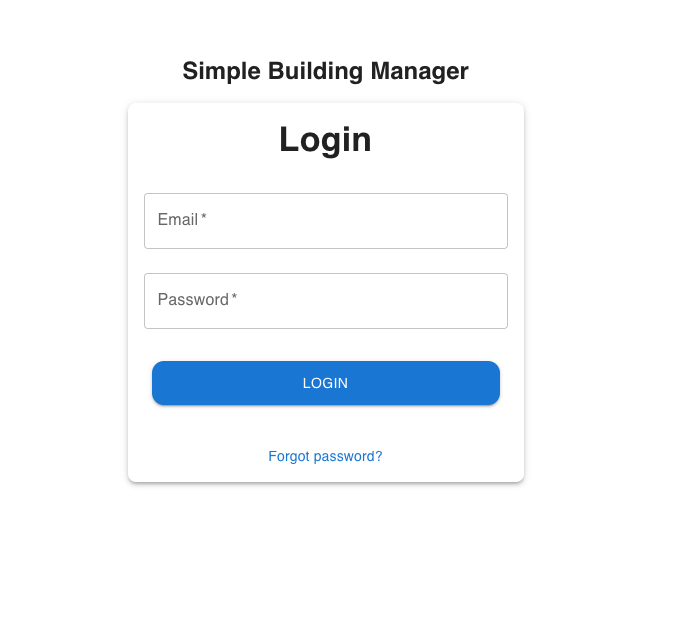
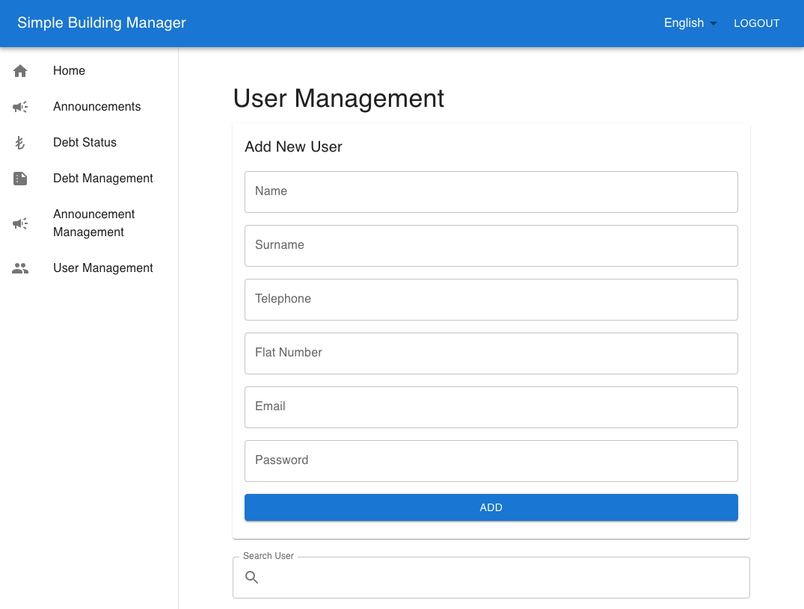
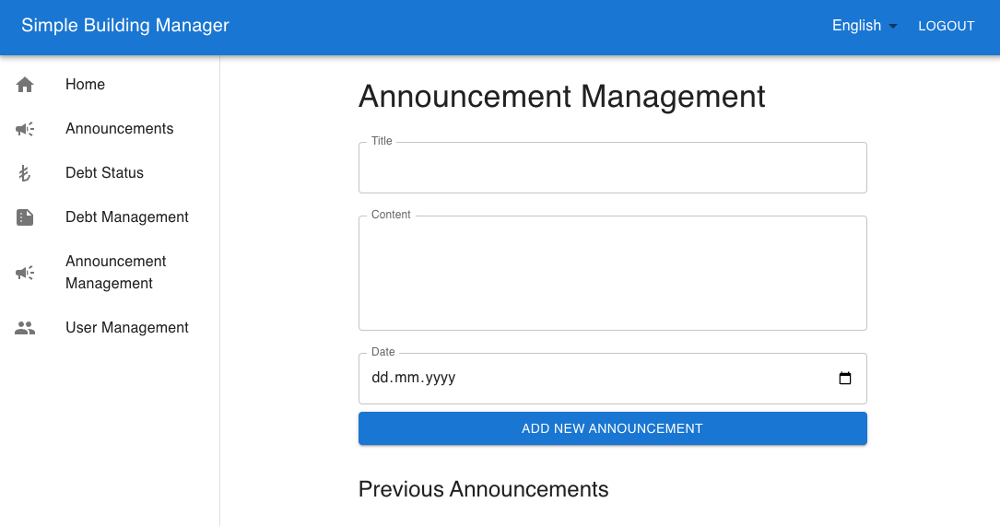
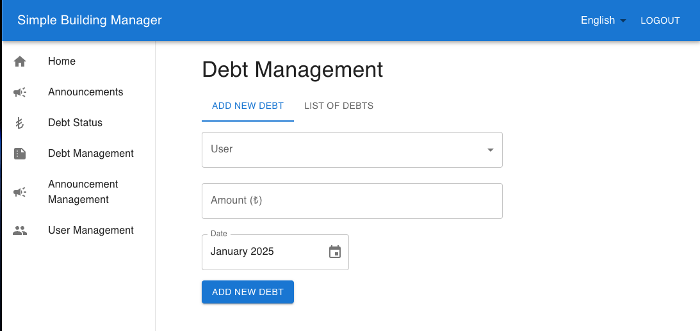
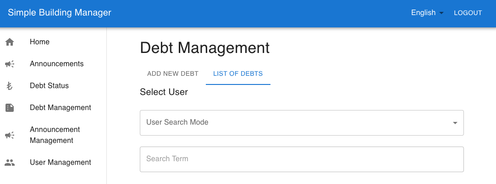
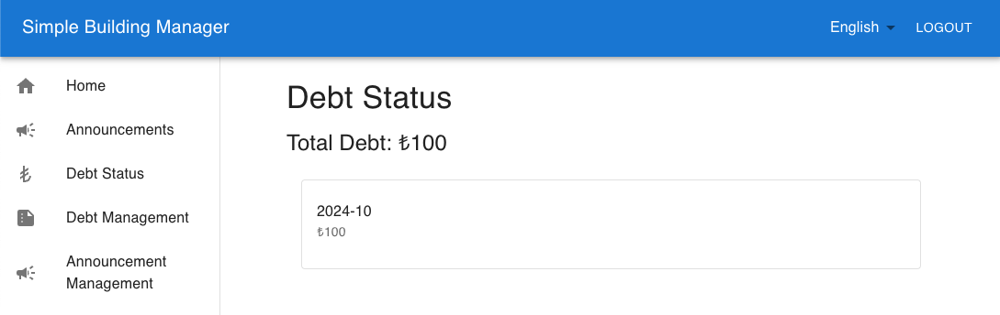

# Simple Building Management (SBM)

This is a simple and multilingual management system for residential communities. This application allows administrators to manage announcements, debts, and members, while residents can log in to view announcements and their financial details.

---

## 🚀 Features

- **Multilingual Support**: Powered by [next-intl](https://next-intl.com), offering seamless multi-language capabilities.
- **Authentication**: Secure authentication handled by Firebase.
- **Real-Time Database**: Data is stored and managed using Firebase Firestore.
- **Material Design**: Elegant UI powered by [MUI](https://mui.com).
- **Date Management**: Intuitive date pickers provided by MUI X Date Pickers and Day.js.
- **Responsive Design**: Styled with TailwindCSS for a mobile-first design approach.
- **Notifications**: Real-time toast notifications using [react-toastify](https://github.com/fkhadra/react-toastify).

---

## 🛠️ Technologies

This project is built using the following technologies and libraries:

### Frontend

- [Next.js](https://nextjs.org) (14.x): React framework for server-side rendering and static site generation.
- [React](https://reactjs.org) (18.x): Core UI framework.
- [Material-UI (MUI)](https://mui.com): UI components and icons.
- [TailwindCSS](https://tailwindcss.com): Utility-first CSS framework.
- [next-intl](https://next-intl.com): Internationalization for Next.js.

### Backend & Authentication

- [Firebase](https://firebase.google.com):
  - Authentication: `@firebase/auth`
  - Firestore Database: Real-time data storage and retrieval.

### Utilities

- [Day.js](https://day.js.org): Lightweight date manipulation library.
- [React Toastify](https://github.com/fkhadra/react-toastify): Toast notifications.

---

## 🔧 Installation and Development

Follow these steps to set up the project locally:

### Prerequisites

- [Node.js](https://nodejs.org) (version 18 or higher recommended)
- [npm](https://npmjs.com) or [yarn](https://yarnpkg.com)

### Steps

1. **Clone the repository**:

   ```bash
   git clone https://github.com/your-username/site-management.git
   cd site-management
   ```

2. **Install dependencies**:

   ```bash
   npm install
   ```

   or

   ```bash
   yarn install
   ```

3. **Configure Firebase**:

   - Create a Firebase project in the [Firebase Console](https://console.firebase.google.com).
   - Add the Firebase configuration to `.env.local`:
     ```
     NEXT_PUBLIC_FIREBASE_API_KEY=your-api-key
     NEXT_PUBLIC_FIREBASE_AUTH_DOMAIN=your-auth-domain
     NEXT_PUBLIC_FIREBASE_PROJECT_ID=your-project-id
     ```

4. **Start the development server**:

   ```bash
   npm run dev
   ```

   or

   ```bash
   yarn dev
   ```

5. **Access the application**:
   Open your browser and navigate to [http://localhost:3000](http://localhost:3000).

### Build for Production

To build the application for production:

```bash
npm run build
```

Then start the production server:

```bash
npm start
```

---

## 📚 Contributing

Contributions are welcome! To get started:

1. Fork the repository.
2. Create a new branch:
   ```bash
   git checkout -b feature/your-feature-name
   ```
3. Make your changes and commit them:
   ```bash
   git commit -m "Add your message here"
   ```
4. Push to your branch:
   ```bash
   git push origin feature/your-feature-name
   ```
5. Create a pull request.

---

## 📜 License

This project is licensed under the **Apache 2.0 License**. See the [LICENSE](./LICENSE) file for details.

---

## 📸 Screenshots








---

## 🌟 Support

If you like this project, consider giving it a ⭐️ on GitHub!
